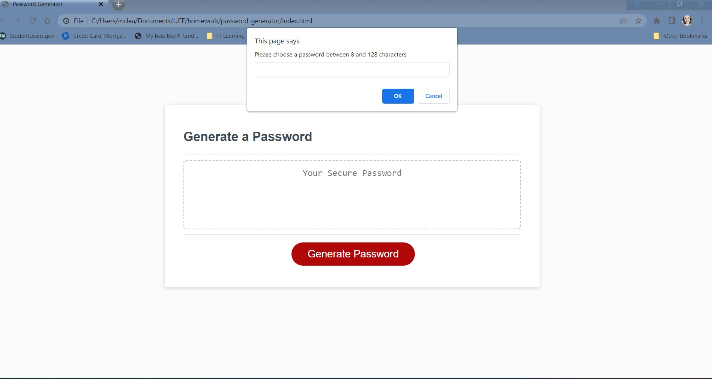
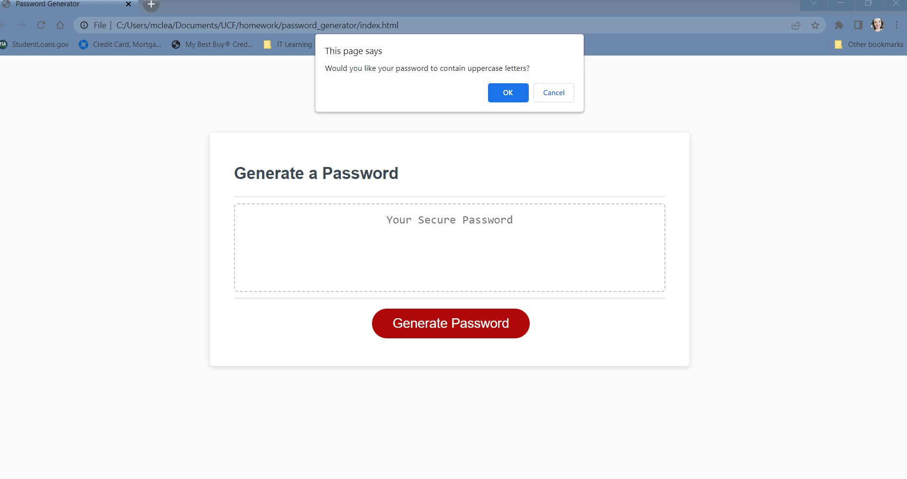
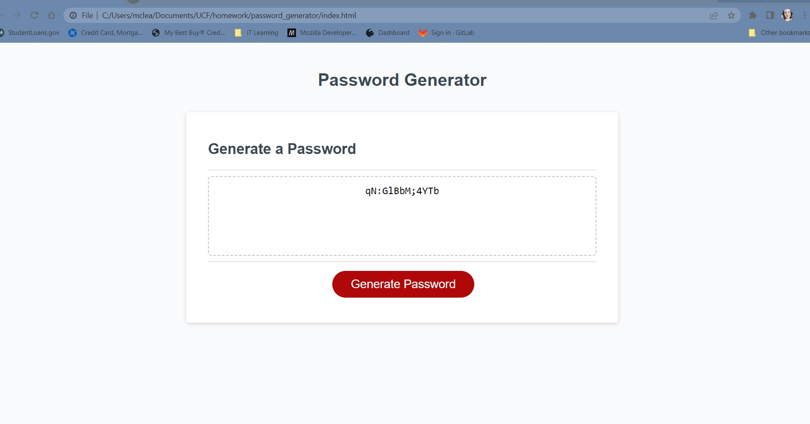

# password_generator

## Description

This project was built to create a random password generator using beginner-intermediate JavaScript. The password generator allows the user to select a length between 8-128 characters and choose the types of characters they want to make up the password. This project was completed using a combination of arrays, for loop, event listeners, and beginner functions to accomplish the desired outcome.

## Usage

To use this page, click the Generate Password button, type in how long you would like your password to be, and answer the following prompts. Once you have answered all prompts, your new password will show up inside the box.

[Click here](https://emilymclean94.github.io/password_generator/) to see the deployed application.

## Credits

Thank you to my classmates, instructor, TA, and tutors!! You were incredibly helpful!

